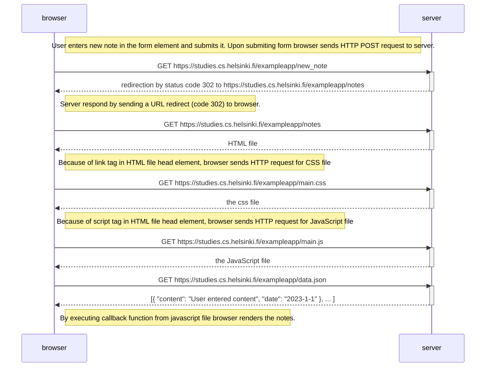

## Exercise 0.4 diagram

```mermaid
sequenceDiagram
    participant browser
    participant server
    
    
    Note right of browser: User enters new note in the form element and submits it. Upon submiting form browser sends HTTP POST request to server.
    
    browser->>server: GET https://studies.cs.helsinki.fi/exampleapp/new_note
    activate server
    server-->>browser: redirection by status code 302 to https://studies.cs.helsinki.fi/exampleapp/notes
    deactivate server
    
    Note right of browser: Server respond by sending a URL redirect (code 302) to browser.
    
    browser->>server: GET https://studies.cs.helsinki.fi/exampleapp/notes
    activate server
    server-->>browser: HTML file
    deactivate server
    
    Note right of browser: Because of link tag in HTML file head element, browser sends HTTP request for CSS file
    
    browser->>server: GET https://studies.cs.helsinki.fi/exampleapp/main.css
    activate server
    server-->>browser: the css file
    deactivate server
    
    Note right of browser: Because of script tag in HTML file head element, browser sends HTTP request for JavaScript file
    
    browser->>server: GET https://studies.cs.helsinki.fi/exampleapp/main.js
    activate server
    server-->>browser: the JavaScript file
    deactivate server
    
    browser->>server: GET https://studies.cs.helsinki.fi/exampleapp/data.json
    activate server
    server-->>browser: [{ "content": "User entered content", "date": "2023-1-1" }, ... ]
    deactivate server    

    Note right of browser: By executing callback function from javascript file browser renders the notes.
```
