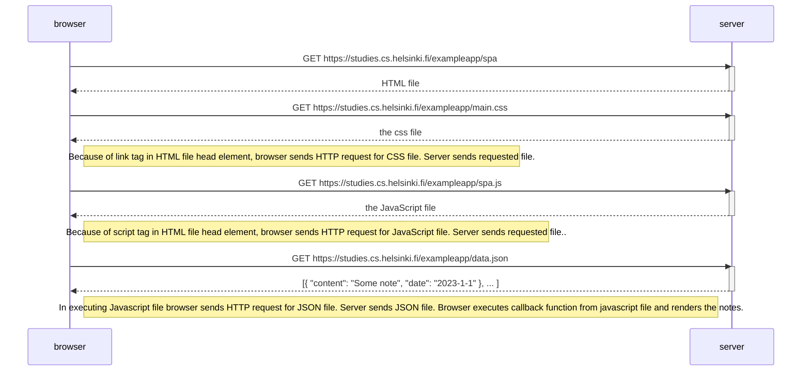

## Exercise 0.5 diagram

```mermaid
sequenceDiagram
    participant browser
    participant server
    
    browser->>server: GET https://studies.cs.helsinki.fi/exampleapp/spa
    activate server
    server-->>browser: HTML file
    deactivate server
    

browser->>server: GET https://studies.cs.helsinki.fi/exampleapp/main.css
    activate server
    server-->>browser: the css file
    deactivate server
    
    Note right of browser: Because of link tag in HTML file head element, browser sends HTTP request for CSS file. Server sends requested file.
       
    browser->>server: GET https://studies.cs.helsinki.fi/exampleapp/spa.js
    activate server
    server-->>browser: the JavaScript file
    deactivate server
    
    Note right of browser: Because of script tag in HTML file head element, browser sends HTTP request for JavaScript file. Server sends requested file..
    
    browser->>server: GET https://studies.cs.helsinki.fi/exampleapp/data.json
    activate server
    server-->>browser: [{ "content": "Some note", "date": "2023-1-1" }, ... ]
    deactivate server    

    Note right of browser: In executing Javascript file browser sends HTTP request for JSON file. Server sends JSON file. Browser executes callback function from javascript file and renders the notes.
```
