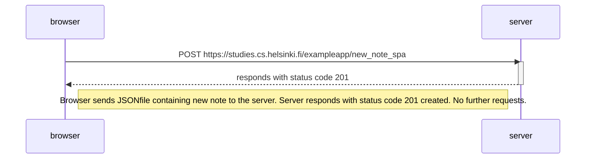

## Exercise 0.5 diagram

```mermaid
sequenceDiagram
    participant browser
    participant server
    
    browser->>server: POST https://studies.cs.helsinki.fi/exampleapp/new_note_spa
    activate server
    server-->>browser: responds with status code 201
    deactivate server
    
    Note right of browser: Browser sends JSONfile containing new note to the server. Server responds with status code 201 created. No further requests.
```
